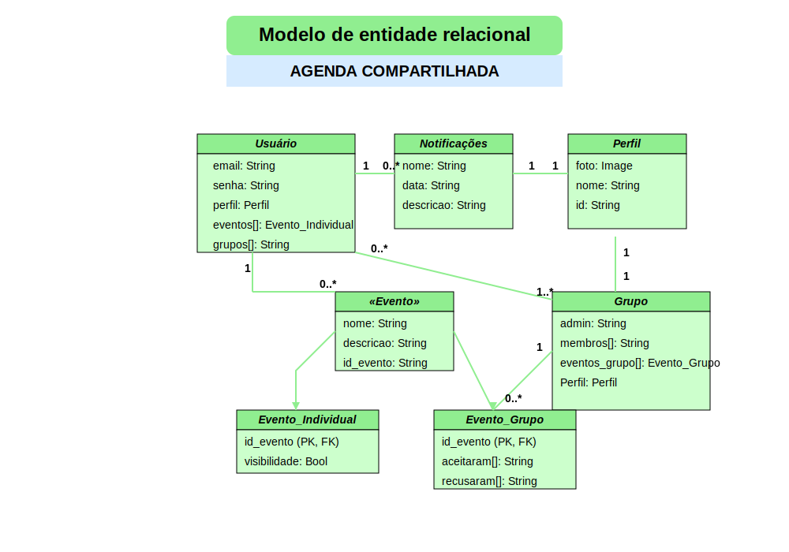

# Arquitetura da Solução

O aplicativo será desenvolvido para dispositivos móveis com foco principal na criação de um front-end ideal, proporcionando uma interface interativa e altamente responsiva. A camada de front-end será construída utilizando React JS, garantindo uma experiência de usuário fluida e dinâmica. O back-end será implementado com NestJS, proporcionando uma estrutura robusta para gerenciar a lógica de negócios e rotas da aplicação de forma eficiente. A API criada com NestJS se conectará ao banco de dados MongoDB, garantindo um armazenamento flexível e escalável de dados.

## Diagrama de Classes

O diagrama de classes ilustra graficamente como será a estrutura do software, e como cada uma das classes da sua estrutura estarão interligadas. Essas classes servem de modelo para materializar os objetos que executarão na memória.

## Modelo ER

Um diagrama de entidade-relacionamento (DER) é uma representação visual que descreve a estrutura de um sistema de banco de dados ou as relações entre entidades (tabelas) dentro desse sistema. Ele usa símbolos gráficos para representar entidades, atributos e os relacionamentos entre entidades. O principal objetivo de um DER é modelar como os dados são organizados e inter-relacionados em um banco de dados, proporcionando uma visão clara das entidades envolvidas e suas conexões. É amplamente utilizado em engenharia de software e gerenciamento de banco de dados para planejar, projetar e documentar sistemas de informações complexos.
O diagrama acima apresenta o modelo entidade-relacionamento para o aplicativo de Agenda Compartilhada, que visa facilitar o agendamento colaborativo entre usuários, similar à experiência de agendamento do Outlook para dispositivos móveis. Neste modelo, são representadas as principais entidades do sistema: Usuário, Perfil, Notificações, Evento (classe abstrata), Evento_Individual, Evento_Grupo e Grupo.
Os usuários se relacionam com notificações (1 para 0..), possuem um perfil (1 para 1), gerenciam eventos individuais (1 para 0..) e pertencem a grupos (0..* para 1..). A entidade Evento serve como base para duas especializações: Evento_Individual e Evento_Grupo, representadas por relacionamentos de herança. Os grupos, por sua vez, estão associados a eventos de grupo (1 para 0..) e possuem um perfil próprio (1 para 1).
Cada entidade possui atributos específicos, como email e senha para Usuário, foto e nome para Perfil, e visibilidade para Evento_Individual. Os relacionamentos entre as entidades são claramente definidos pelas linhas que as conectam, com as cardinalidades indicando a quantidade de instâncias que podem participar em cada relacionamento.
Este modelo ER fornece a base estrutural para o desenvolvimento do banco de dados do aplicativo, permitindo a implementação eficiente das funcionalidades de agendamento colaborativo e gerenciamento de compromissos compartilhados.

## Esquema Relacional

O Esquema Relacional corresponde à representação dos dados em tabelas juntamente com as restrições de integridade e chave primária.
 
As referências abaixo irão auxiliá-lo na geração do artefato “Esquema Relacional”.

> - [Criando um modelo relacional - Documentação da IBM](https://www.ibm.com/docs/pt-br/cognos-analytics/10.2.2?topic=designer-creating-relational-model)

## Modelo Físico

Entregar um arquivo banco.sql contendo os scripts de criação das tabelas do banco de dados. Este arquivo deverá ser incluído dentro da pasta src\bd.

## Tecnologias Utilizadas

- **Git**: Ferramenta utilizada para o versionamento de código.
- **GitHub**: Repositório para armazenar os arquivos do projeto.
- **Sourcetree**: Interface gráfica para facilitar o uso do Git.
- **Gitflow**: Ferramenta que organiza o fluxo de branches do projeto.

- **IDEs**: Softwares utilizados para o desenvolvimento do código
  - Visual Studio Code
  - IntelliJ
  - Expo

- **MongoDB**: Banco de dados não relacional para armazenamento das informações do sistema.
- **React Native**: Framework para o desenvolvimento da interface do sistema.
- **Nest JS**: Framework para o back-end, responsável pela comunicação entre o banco de dados e a interface.

- **Trello**: Plataforma usada para gerenciar os quadros e as tarefas da equipe.

## Hospedagem

Explique como a hospedagem e o lançamento da plataforma foi feita.

> **Links Úteis**:
>
> - [Website com GitHub Pages](https://pages.github.com/)
> - [Programação colaborativa com Repl.it](https://repl.it/)
> - [Getting Started with Heroku](https://devcenter.heroku.com/start)
> - [Publicando Seu Site No Heroku](http://pythonclub.com.br/publicando-seu-hello-world-no-heroku.html)

## Qualidade de Software

Conceituar qualidade de fato é uma tarefa complexa, mas ela pode ser vista como um método gerencial que através de procedimentos disseminados por toda a organização, busca garantir um produto final que satisfaça às expectativas dos stakeholders.

No contexto de desenvolvimento de software, qualidade pode ser entendida como um conjunto de características a serem satisfeitas, de modo que o produto de software atenda às necessidades de seus usuários. Entretanto, tal nível de satisfação nem sempre é alcançado de forma espontânea, devendo ser continuamente construído. Assim, a qualidade do produto depende fortemente do seu respectivo processo de desenvolvimento.

A norma internacional ISO/IEC 25010, que é uma atualização da ISO/IEC 9126, define oito características e 30 subcaracterísticas de qualidade para produtos de software.
Com base nessas características e nas respectivas sub-características, identifique as sub-características que sua equipe utilizará como base para nortear o desenvolvimento do projeto de software considerando-se alguns aspectos simples de qualidade. Justifique as subcaracterísticas escolhidas pelo time e elenque as métricas que permitirão a equipe avaliar os objetos de interesse.

> **Links Úteis**:
>
> - [ISO/IEC 25010:2011 - Systems and software engineering — Systems and software Quality Requirements and Evaluation (SQuaRE) — System and software quality models](https://www.iso.org/standard/35733.html/)
> - [Análise sobre a ISO 9126 – NBR 13596](https://www.tiespecialistas.com.br/analise-sobre-iso-9126-nbr-13596/)
> - [Qualidade de Software - Engenharia de Software 29](https://www.devmedia.com.br/qualidade-de-software-engenharia-de-software-29/18209/)
