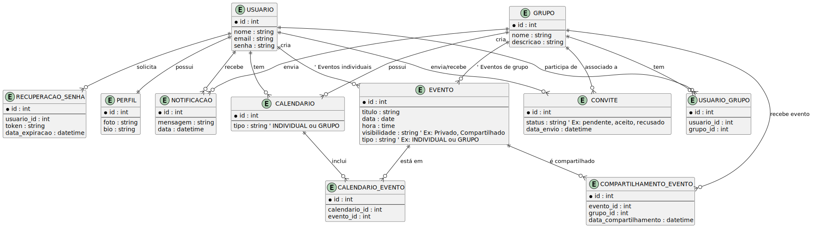

# Arquitetura da Solução

O aplicativo será desenvolvido para dispositivos móveis com foco principal na criação de um front-end ideal, proporcionando uma interface interativa e altamente responsiva. A camada de front-end será construída utilizando React JS, garantindo uma experiência de usuário fluida e dinâmica. O back-end será implementado com NestJS, proporcionando uma estrutura robusta para gerenciar a lógica de negócios e rotas da aplicação de forma eficiente. A API criada com NestJS se conectará ao banco de dados MongoDB, garantindo um armazenamento flexível e escalável de dados.


## Diagrama de Classes

O diagrama de classes ilustra graficamente como será a estrutura do software, e como cada uma das classes da sua estrutura estarão interligadas. Essas classes servem de modelo para materializar os objetos que executarão na memória.


## Modelo ER
O modelo ER proposto organiza as principais entidades necessárias para o funcionamento do sistema de Agenda Compartilhada, permitindo o agendamento colaborativo e o gerenciamento de eventos de forma estruturada. Segue uma explicação detalhada de cada componente e de seus relacionamentos:

Abaixo segue uma descrição objetiva e detalhada do diagrama de Entidade-Relacionamento (ER) apresentado:


## 1. Entidades e Atributos

1. **USUARIO**
  - **id** (int)
  - **nome** (string)
  - **email** (string)
  - **senha** (string)
  - **data_criacao** (datetime)
  - Representa os usuários do sistema. Cada usuário tem um identificador único, além de dados como nome, e-mail, senha e data de criação do registro.

2. **PERFIL**
  - **id** (int)
  - **nome** (string)
  - Indica perfis (ou papéis) que podem ser associados a usuários, por exemplo “Administrador”, “Membro”, etc.

3. **RECUPERACAO_SENHA**
  - **id** (int)
  - **user_id** (int)
  - **data_expiracao** (datetime)
  - Armazena informações para recuperação de senha de um usuário, incluindo a data de expiração desse pedido de recuperação.

4. **NOTIFICACAO**
  - **id** (int)
  - **mensagem** (string)
  - **data_criacao** (datetime)
  - Guarda notificações enviadas ou recebidas pelos usuários (mensagens de aviso, alertas, etc.).

5. **CALENDARIO**
  - **id** (int)
  - **nome** (string)
  - **visibilidade** (string)
  - **created_at** (datetime)
  - Representa calendários que podem pertencer a um usuário. Pode ter um nível de visibilidade (público, privado, etc.) e a data de criação.

6. **EVENTO**
  - **id** (int)
  - **nome** (string)
  - **descricao** (string)
  - **data_inicio** (datetime)
  - **data_fim** (datetime)
  - **local** (string)
  - **visibilidade** (string)
  - **type** (string) – Ex.: “Private”, “Compartilhado”
  - Refere-se a eventos que podem estar vinculados a um calendário, a um usuário ou a um grupo. Possui atributos de data, local, descrição, tipo, etc.

7. **CONVITE**
  - **id** (int)
  - **status** (string) – Ex.: “pendente”, “aceito”, “recusado”
  - Trata dos convites que podem ser enviados para participação em eventos ou grupos. O status indica a situação do convite.

8. **GRUPO**
  - **id** (int)
  - **nome** (string)
  - **descricao** (string)
  - Representa grupos dentro do sistema, que podem ter vários membros (usuários) e organizar eventos.

9. **COMPARTILHAMENTO_EVENTO**
  - **id** (int)
  - **usuario_id** (int)
  - **evento_id** (int)
  - **data_compartilhamento** (datetime)
  - Entidade que registra o compartilhamento de um evento por parte de um usuário, armazenando a data em que ocorreu esse compartilhamento.

---

## 2. Relacionamentos Principais

1. **USUÁRIO – PERFIL**
  - Um usuário pode estar associado a um perfil (por exemplo, para definir permissões ou funções no sistema).
  - A cardinalidade exata (1:1, 1:N ou N:M) não está totalmente explícita no diagrama, mas geralmente um usuário pode ter um perfil principal ou vários perfis dependendo das regras de negócio.

2. **USUÁRIO – RECUPERACAO_SENHA**
  - Um usuário pode ter vários registros de recuperação de senha ao longo do tempo.
  - Cada recuperação de senha pertence a um único usuário.

3. **USUÁRIO – NOTIFICAÇÃO**
  - Representa as notificações que um usuário recebe ou que podem ser enviadas em nome dele.
  - Geralmente é um relacionamento 1:N (um usuário pode ter várias notificações).

4. **USUÁRIO – CALENDARIO**
  - Um usuário pode ter vários calendários (pessoais, de trabalho, etc.).
  - Cada calendário pertence a um único usuário (normalmente 1:N).

5. **CALENDARIO – EVENTO**
  - Um calendário pode conter vários eventos.
  - Cada evento, nesse contexto, está vinculado a um calendário específico.

6. **EVENTO – GRUPO**
  - Um grupo pode ter vários eventos associados (por exemplo, eventos organizados por aquele grupo).
  - Um evento pode pertencer a um grupo ou ser individual de um usuário, conforme o modelo.

7. **EVENTO – CONVITE**
  - Podem existir convites relacionados a um evento específico.
  - Exemplo: convidar usuários ou membros de um grupo para participar de um evento.

8. **GRUPO – CONVITE**
  - Um grupo também pode estar envolvido no envio de convites para participação no grupo ou em eventos do grupo.

9. **USUÁRIO – COMPARTILHAMENTO_EVENTO** / **EVENTO – COMPARTILHAMENTO_EVENTO**
  - O compartilhamento de um evento registra que determinado usuário compartilhou um evento em certa data.
  - A tabela (entidade) COMPARTILHAMENTO_EVENTO faz a associação entre USUÁRIO e EVENTO com informações adicionais (data do compartilhamento).

---

## 3. Observações Gerais

- A entidade **USUARIO** centraliza a maior parte das interações:
  - Ele pode ter perfis, receber notificações, ter calendários e criar/compartilhar eventos.
- **GRUPO** funciona como um agrupador de usuários e de eventos, possivelmente permitindo que vários usuários participem de um mesmo grupo e organizem eventos em conjunto.
- **CONVITE** atua como uma forma de gerenciar a entrada de usuários em grupos ou eventos, armazenando o status do convite.
- **RECUPERACAO_SENHA** trata apenas do fluxo de redefinição de senha para cada usuário.
- **COMPARTILHAMENTO_EVENTO** é uma entidade de relacionamento que registra, de forma histórica, quem compartilhou qual evento e quando.



## Esquema Relacional
Como o MongoDB é um banco de dados orientado a documentos, a estrutura dos dados é organizada em coleções, onde cada documento pode ter um formato flexível. No nosso modelo, separamos as informações em coleções que correspondem, de forma análoga, às entidades do modelo conceitual, porém utilizando referências (por meio de ObjectId) para relacionar documentos quando necessário. A seguir, o script que cria as coleções com validação de esquema usando JSON Schema:

## Modelo Físico

scrip anexado (pasta src) -[setup.js](../src/setup.js)

## Tecnologias Utilizadas

- **Git**: Ferramenta utilizada para o versionamento de código.
- **GitHub**: Repositório para armazenar os arquivos do projeto.
- **Sourcetree**: Interface gráfica para facilitar o uso do Git.
- **Gitflow**: Ferramenta que organiza o fluxo de branches do projeto.

- **IDEs**: Softwares utilizados para o desenvolvimento do código
  - Visual Studio Code
  - IntelliJ
  - Expo

- **MongoDB**: Banco de dados não relacional para armazenamento das informações do sistema.
- **React Native**: Framework para o desenvolvimento da interface do sistema.
- **Nest JS**: Framework para o back-end, responsável pela comunicação entre o banco de dados e a interface.

- **Trello**: Plataforma usada para gerenciar os quadros e as tarefas da equipe.

## Hospedagem

Na etapa de hospedagem, o aplicativo **Agenda Compartilhada** foi publicado em um servidor em nuvem para garantir alta disponibilidade e escalabilidade. A escolha do provedor de hospedagem atendeu aos seguintes requisitos:

- **Capacidade**: O servidor selecionado dispõe de recursos (CPU, memória e armazenamento) suficientes para suportar o tráfego esperado, tanto para o uso cotidiano quanto para eventuais picos de acesso.
- **Segurança**: Foram adotadas medidas de segurança, como criptografia (HTTPS), monitoramento de acessos e regras de firewall, para proteger os dados dos usuários e as comunicações entre o aplicativo e o servidor.
- **Performance**: O provedor de nuvem oferece recursos de escalabilidade automática (autoscaling) e balanceamento de carga, garantindo que o aplicativo responda de forma eficiente e mantendo uma boa experiência de uso.

---

### LANÇAMENTO
Na etapa de lançamento, o aplicativo **Agenda Compartilhada** foi disponibilizado para os usuários. O processo de publicação contemplou:

- **Plataformas**: O app foi distribuído na **Google Play** (Android), facilitando a instalação e atualizações automáticas para os usuários.
- **Comunicação**: Foram criadas campanhas de divulgação em redes sociais, e-mails e outros canais, destacando os principais recursos do aplicativo (agendamento colaborativo, notificações em tempo real, sincronização de calendário etc.).
- **Suporte e Feedback**: Após o lançamento, uma equipe de suporte ficou responsável por monitorar feedbacks e avaliações na loja de aplicativos, além de acompanhar métricas de uso para identificar melhorias e correções necessárias.

---

## Qualidade de Software

A ISO 9126 é uma norma internacional que define um conjunto de características e subcaracterísticas para a avaliação da qualidade de software. Essa norma orienta a análise de diversos aspectos do software, desde a funcionalidade e usabilidade até a confiabilidade e eficiência. No contexto do projeto Agenda Compartilhada, a ISO 9126 serve como um guia para garantir que o aplicativo atenda não apenas aos requisitos funcionais, mas também proporcione uma experiência de usuário satisfatória, segurança, desempenho e facilidade de manutenção.

A seguir, estão os principais aspectos da ISO 9126 aplicados ao projeto:
Abaixo apresentamos um modelo de **Qualidade de Software** e **Padrões de Codificação**, inspirado na norma **ISO 9126** e adaptado ao projeto **Agenda Compartilhada**, que visa fornecer um aplicativo de agendamento colaborativo desenvolvido em **React Native**, com **NestJS** no backend e **MongoDB** como banco de dados.


| **Característica** | **Subcaracterística** | **Definição** |
|--------------------|-----------------------|---------------|
| **Funcionalidade** | **Adequação**         | Fornecer funcionalidades para criação e gerenciamento de grupos e eventos, refletindo as necessidades de agendamento colaborativo. |
|                    | **Acurácia**          | Garantir que as informações sobre eventos, horários e participantes sejam exibidas de forma precisa e atualizada para todos os usuários. |
|                    | **Interoperabilidade** | Compatibilidade entre diferentes plataformas (Android, e potencialmente iOS ou web), além de integração com serviços externos (por exemplo, importação de compromissos pessoais). |
|                    | **Segurança**         | Uso de autenticação JWT, criptografia de dados sensíveis e conformidade com boas práticas de segurança (como proteção de endpoints e armazenamento seguro de tokens). |
|                    | **Conformidade**      | Observância das leis de proteção de dados e normas aplicáveis, além do respeito a requisitos de acessibilidade e usabilidade. |
| **Usabilidade**    | **Inteligibilidade**  | Interface intuitiva, com telas claras e navegação simples, de modo que usuários entendam facilmente como usar o aplicativo. |
|                    | **Apreensibilidade**  | Disponibilização de tutoriais ou dicas rápidas dentro do app, ajudando usuários novatos a configurar seu calendário ou criar grupos e eventos. |
|                    | **Operabilidade**     | Design focado em dispositivos móveis, com botões, campos e fluxos que facilitem a criação de eventos, convites e a gestão de grupos. |
|                    | **Atratividade**      | Layout visual agradável, ícones e paleta de cores consistentes para garantir uma boa experiência de uso. |
|                    | **Conformidade**      | Aderência às guidelines de design para plataformas móveis (Material Design no Android), boas práticas de UX e UI. |
| **Confiabilidade** | **Maturidade**        | Redução de falhas em produção por meio de testes (unitários, de integração e e2e) e monitoramento contínuo dos serviços de backend (NestJS). |
|                    | **Tolerância a Falhas** | Mecanismos de retry e salvamento local temporário (Offline-first) para garantir que dados não sejam perdidos em caso de falhas de rede. |
|                    | **Disponibilidade**   | Infraestrutura em nuvem escalável, com suporte a múltiplas instâncias e balanceamento de carga, garantindo uptime elevado. |
| **Eficiência**     | **Desempenho**        | Respostas rápidas em operações de criação/edição de eventos e grupos, além de atualizações em tempo real via WebSockets. |
|                    | **Utilização de Recursos** | Otimização do backend NestJS e uso de índices no MongoDB para melhorar consultas; no frontend, uso de técnicas como lazy loading para componentes. |
| **Manutenibilidade** | **Modularidade**    | Separação clara das camadas (React Native no frontend, NestJS no backend, MongoDB como banco) e organização do código em módulos reutilizáveis. |
|                    | **Analisabilidade**   | Uso de logs estruturados e ferramentas de monitoramento (por exemplo, Kibana ou Sentry) para facilitar identificação de erros. |
|                    | **Modificabilidade**  | Estrutura de projeto que permite fácil adição de novas funcionalidades (ex.: novos tipos de notificação) sem quebrar o código existente. |
| **Portabilidade**  | **Adaptabilidade**    | Código React Native que pode ser empacotado para Android ou iOS (se for expandir futuramente), e uso de contêineres Docker para o backend. |
|                    | **Coexistência**      | Integração com outros sistemas de calendário (via API), mantendo dados consistentes em diferentes dispositivos. |

---

## Qualidade dos Padrões de Codificação

### 1. Armazenamento Local (AsyncStorage ou similar no React Native)

- **Nomeação de Chaves**  
  Use nomes descritivos para facilitar a compreensão do conteúdo armazenado.  
  Exemplo: Em vez de `usrTok`, use `userAuthToken`.

- **Verificação de Existência**  
  Sempre verifique se a chave já existe antes de tentar recuperar dados.  
  Exemplo:
  ```javascript
  const token = await AsyncStorage.getItem('userAuthToken');
  if (token !== null) {
    // Já existe um token armazenado
  }
  ```

- **Segurança**  
  Evite armazenar informações extremamente sensíveis (como senhas). Para tokens JWT, avalie o uso de soluções seguras (como SecureStore, no caso do iOS) ou criptografia local.

### 2. JSON

- **Indentação**  
  Mantenha indentação consistente (2 espaços, por exemplo) ao manipular JSON no frontend ou backend, facilitando a leitura e a revisão do código.

- **Nomeação de Atributos**  
  Utilize `camelCase` para atributos e nomes de variáveis.  
  Exemplo:
  ```json
  {
    "firstName": "João",
    "lastName": "Silva"
  }
  ```

- **Validação de JSON**  
  Antes de enviar ou receber dados do backend, valide o JSON para evitar erros de parsing ou inconsistências. Bibliotecas como `class-validator` (NestJS) podem auxiliar no backend.

- **Tipos de Dados**  
  Garanta que cada atributo mantenha seu tipo em toda a aplicação. Se um campo for numérico (ex.: duração do evento), mantenha esse padrão para evitar problemas de conversão no frontend.

### 3. Organização do Código

- **Estrutura de Pastas**
  - **Frontend (React Native)**: Organizar componentes, telas e serviços (ex.: `screens/`, `components/`, `services/`) para separar responsabilidades.
  - **Backend (NestJS)**: Utilizar módulos (`@Module`), controladores (`@Controller`) e serviços (`@Injectable`) bem definidos para cada domínio (Usuários, Grupos, Eventos).

- **Nomenclatura**
  - Use nomes significativos para classes, métodos e variáveis.
  - Evite abreviações desnecessárias.

- **Controle de Versão**
  - Padronize mensagens de commit.
  - Use branches para funcionalidades específicas, revisando o código antes de mesclar.

---


> **Links Úteis**:
>
> - [ISO/IEC 25010:2011 - Systems and software engineering — Systems and software Quality Requirements and Evaluation (SQuaRE) — System and software quality models](https://www.iso.org/standard/35733.html/)
> - [Análise sobre a ISO 9126 – NBR 13596](https://www.tiespecialistas.com.br/analise-sobre-iso-9126-nbr-13596/)
> - [Qualidade de Software - Engenharia de Software 29](https://www.devmedia.com.br/qualidade-de-software-engenharia-de-software-29/18209/)
